# Oscilador Local

O oscilador local é responsável por fornecer o tom para o batimento com o sinal recebido. Deve proporcionar a frequência adequada dependendo do canal sintonizado, de forma que à imagem resultante seja aplicado um único filtro.

Especificações:
  - Range de frequência : 108 a 136,9917 MHz
  - Espaçamento entre os canais : 8,33 ou 25 KHz
  - Largura de banda do canal: 3 ou 7,5 KHz
  - FI em 455 KHz, proposta de filtro
  - Temperatura de operação: -10 a 60 °C

Dessa forma é necessário um sintetizador capaz de gerar um tom que será utilizado no batimento com o sinal recebido. Esse tom deve ser variável conforme o canal que queremos sintonizar, de maneira que o resultado tenha sempre a mesma frequência central, para usarmos um único filtro de imagem.

O Si464, cujo datasheet está disponível no repositório, foi sugerido por ser capaz de sintonizar as frequências desejadas sem a necessidade de um oscilador externo, ter uma comunicação mais conhecida (SPI) e disponibilizar demodulações alternativas, para comparação e testes.

Dados:
 - Saída de até +20 dBm , dispensando amplificação para o mixer, que trabalha com input de +13 dBm;
 - Consumo de corrente: 10,6 ou 13,6 mA ,para baixa ou alta performance;
 - Alimentação: 3,3V típico;
 - Faixa de frequências de saída: 119–960 MHz ,usando o oscilador a cristal interno de 30 Mhz,
 - Ruído de fase para um shift de 10 Khz da frequência central, para portadora à 460 Mhz: -106 dBc/Hz;
 - Dimensões: 4x4 mm;
 - Temperatura de operação : -40 à +85 °C;

Frequência de saída do sintetizador:

Como vimos nos dados acima , para um cristal de 30 Mhz o range de frequências de saída do oscilador é inferior ao necessário, começa em 119 Mhz. Dessa forma é necessário usar um TCXO com frequência inferior à 30 Mhz.

### Calculo da frequência do TCXO

Baseando-se na equação do datasheet para o PLL Fractional-N:  

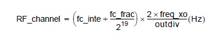

Usando o menor outdiv : 24 e verificando o menor valor para o termo multiplicativo nos valores de registradores da parte real e fracionária, a parte fracionária é irrelevante para o valore mínimo se ajustada para o mínimo possível.

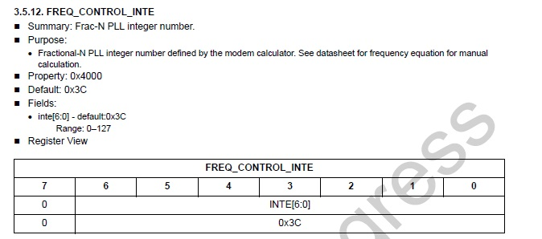

O valor mínimo é 0x3C = 60 . Usando a fórmula temos 60 x 60 / 24 = 150 MHz de mínimo e não o indicado na tabela 119 MHz

Fonte APIsi4464 (marca d'água de work in progress) pdf na pasta do git, no  site da Silicon Labs não achei nehuma outra fonte para os valores de registradores.

### Cálculo das frequências

É possível programar uma frequência inicial e depois passos, para atender todos os canais sem a necessidade de alterar quatro registradores, com EZ Frequency programmer.

Primeira frequência para pulsar : 108 MHz + Freq central (em relação a 108 MHz) + 455 KHz.
Dessa forma o batimento resultará em tornar a frequência central do sinal resultante 455 KHz.

Espaçamento entre as frequências centrais : 1,5+8,33+1,5 = 11,33 KHz  ou 3,75+25+3,75 = 32,5 KHz.

Primeira frequência central : 108,4565 MHz ou 108,45875 MHz.

## Diagrama de blocos:

Em cinza a parte do sintetizador.

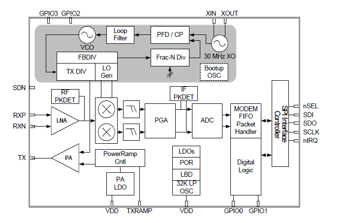

## Pinagem:

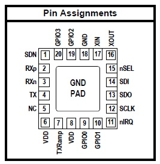

## Esquemáticos

Tendo como referência as documentações da Silicon Labs: [AN785](AN785.pdf) e [AN629](AN629.pdf) os seguintes esquemáticos para o XTAL e sintetizador foram sugeridos:

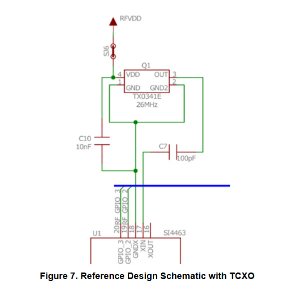

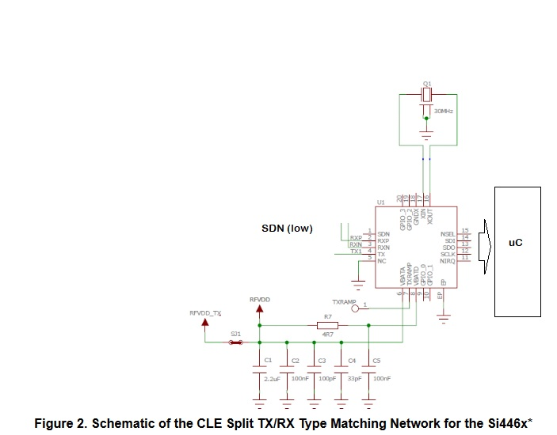

## Teste de ruído de fase:

Teste real:

Teste no simulador AWR:

Para o teste foram desenvolvidos dois circuitos para a downconversion do sinal RF utilizando um modelo de mixer próximo ao adotado, o que foi modificado foram os valores de P1db e IP3 que estavam próximos a potência do sinal RF na documentação do mixer.

O objetivo foi analisar o impacto do ruído de fase do oscilador local no batimento, os valores de ruído de fase usados na simulação foram os 4 disponíveis no datasheet e apresentados no seguinte gráfico:

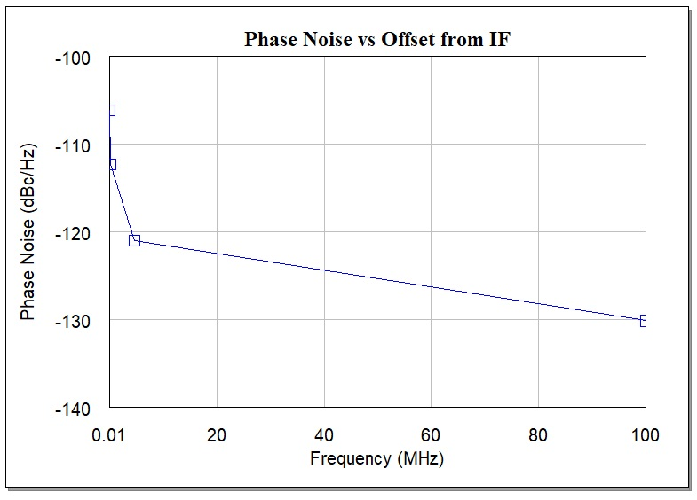

Os resultado para o circuito:

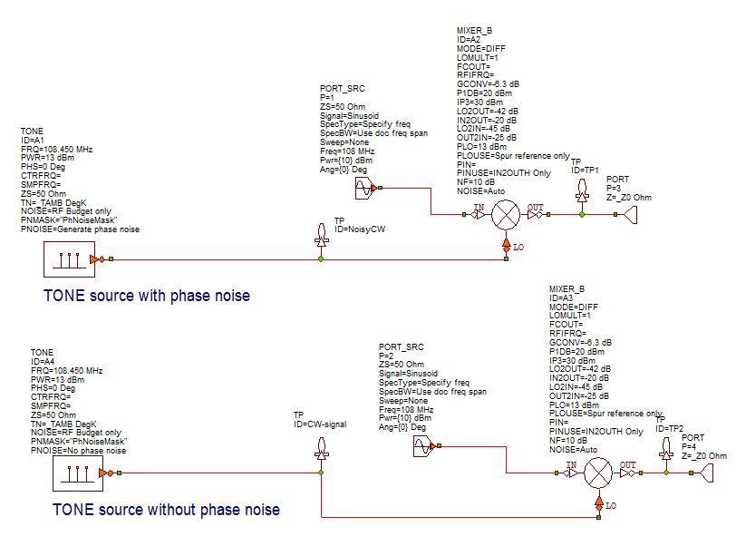

foram:

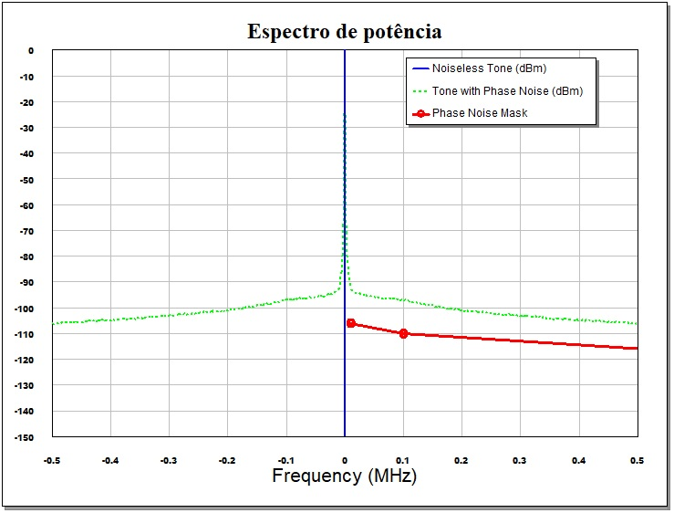

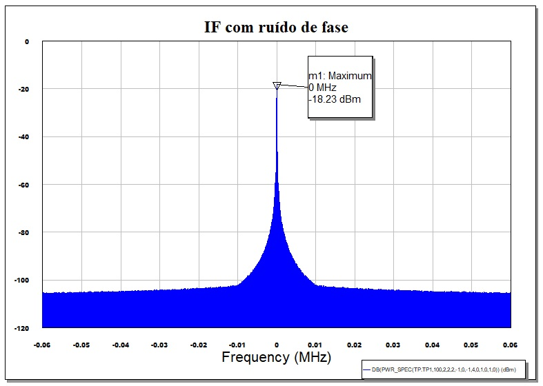

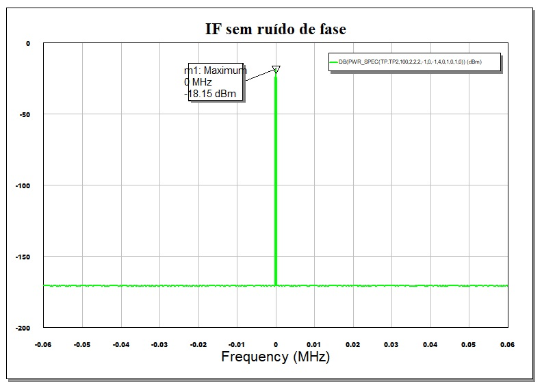
