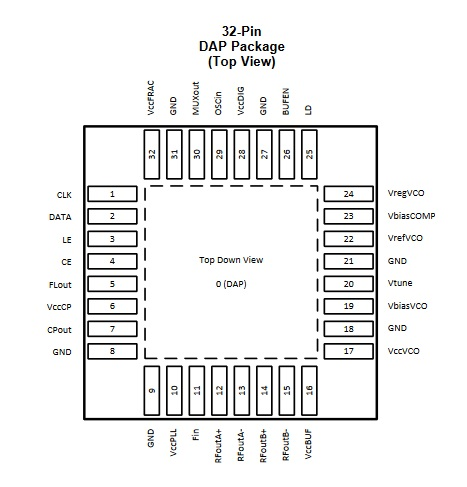

# Oscilador Local

O oscilador local é responsável por fornecer o tom para o batimento com o sinal recebido. Deve proporcionar a frequência adequada dependendo do canal sintonizado, de forma que à imagem resultante seja aplicado um único filtro.

Especificações:
  - Range de frequência : 108 a 136,9917 MHz
  - Espaçamento entre os canais : 8.33 ou 25 KHz
  - Largura de banda do canal: 7,5 KHz
  - FI em 375 KHz, proposta de filtro
  - Temperatura de operação: -10 a 60 °C

Dessa forma é necessário uma fonte de frequência de referência, oriunda de um oscilador a cristal com compensação de temperatura ( TCXO ), para um sintetizador de frequência, capaz de gerar outras.

O Si4133 usado como referência possui dois registradores (N 18 bits e R 13 bits) programáveis via serial (USART) para ajuste da frequência.

Fout = (N/R) x Fref

Primeira frequencia para pulsar : 108 MHz + Freq central (em relação a 108 MHz) + 375 KHz
Dessa forma o batimento resultará em tornar a frequencia central do sinal resultante 375 KHz.
Primeira frequência: 108.37875 MHz

Espaçamento entre os canais: 3,75+25+3,75 =32,5 KHz  ou 3,75+8,33+3,75 = 15,83 KHz

Para frequência de referência adota-se um TCXO de 26 MHz ASTX modelo D da Abracon.

Como sugestão de sintetizador foi adotado o modelo LMX2581 da Texas.

Alimentação:
 - Sintetizador: 3,3 V
 - TCXO : 3,3V

Consumo de corrente:
 - Sintetizador: 178 mA
 - TCXO : 1,5 mA

Dimensões:
 -TCXO: 2 x 1,6mm

Diagrama de blocos:

TCXO:

Sintetizador:

Temporização protocolo MICROWIRE:

# Update

O Si464, cujo datasheet está disponível no repositório, foi sugerido por ser capaz de sintonizar as frequências desejadas sem a necessidade de um oscilador externo, ter uma comunicação mais conhecida (SPI) e disponibilizar demodulações alternativas, para comparação e testes.

Dados:
 - Saída de até +20 dBm , dispensando amplificação para o mixer, que trabalha com input de +13 dBm;
 - Consumo de corrente: 10.6/13.6 mA;
 - Alimentação: 3,3V típico;
 - Faixa de frequências de saída: 119–960 MHz ,usando o oscilador a cristal interno de 30 Mhz ;
 - Ruído de fase para um shift de 10 Khz da frequência central, para portadora à 460 Mhz: -106 dBc/Hz  
