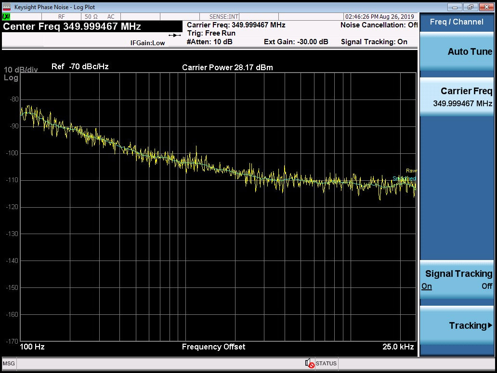

# Oscilador Local

O oscilador local é responsável por fornecer o tom para o batimento com o sinal recebido. Deve proporcionar a frequência adequada dependendo do canal sintonizado, de forma que à imagem resultante seja aplicado um único filtro.

Especificações:
  - Range de frequência : 108 a 136,9917 MHz
  - Espaçamento entre os canais : 8,33 ou 25 KHz
  - Largura de banda do canal: 3 ou 7,5 KHz
  - FI em 455 KHz, proposta de filtro
  - Temperatura de operação: -10 a 60 °C

Dessa forma é necessário um sintetizador capaz de gerar um tom que será utilizado no batimento com o sinal recebido. Esse tom deve ser variável conforme o canal que queremos sintonizar, de maneira que o resultado tenha sempre a mesma frequência central, para usarmos um único filtro de imagem.

O Si464, cujo datasheet está disponível no repositório, foi sugerido por ser capaz de sintonizar as frequências desejadas sem a necessidade de um oscilador externo, ter uma comunicação mais conhecida (SPI) e disponibilizar demodulações alternativas, para comparação e testes.

Dados:
 - Saída de até +20 dBm , dispensando amplificação para o mixer, que trabalha com input de +13 dBm;
 - Consumo de corrente: 10,6 ou 13,6 mA ,para baixa ou alta performance;
 - Alimentação: 3,3V típico;
 - Faixa de frequências de saída: 119–960 MHz ,usando o oscilador a cristal interno de 30 Mhz ;
 - Ruído de fase para um shift de 10 Khz da frequência central, para portadora à 460 Mhz: -106 dBc/Hz;
 - Dimensões: 4x4 mm;

Frequência de saída do sintetizador:

A frequência é  ajustada via comandos pelo microcontrolador que alteram os parâmetros de integração e divisão do sinal.

É possível programar uma frequência inicial e depois passos, para atender todos os canais sem a necessidade de alterar quatro registradores, com EZ Frequency programmer.

Primeira frequencia para pulsar : 108 MHz + Freq central (em relação a 108 MHz) + 455 KHz.
Dessa forma o batimento resultará em tornar a frequencia central do sinal resultante 455 KHz.

Espaçamento entre as frequências centrais : 1,5+8,33+1,5 = 11,33 KHz  ou 3,75+25+3,75 = 32,5 KHz.

Primeira frequência central : 108,4565 MHz ou 108,45875 MHz.

Como sugestão de sintetizador foi adotado o modelo LMX2581 da Texas.

Diagrama de blocos:

Em cinza a parte do sintetizador.

Pinagem:

Teste de ruído de fase:

