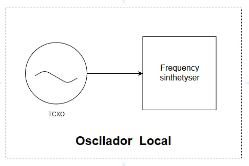

# Oscilador Local

O oscilador local é responsável por fornecer o tom para o batimento com o sinal recebido. Deve proporcionar a frequência adequada dependendo do canal sintonizado, de forma que à imagem resultante seja aplicado um único filtro. 

Especificações:
  - Range de frequência : 108 a 136,9917 MHz
  - Espaçamento entre os canais : 25 KHz
  - Largura de banda do canal: 7 KHz
  - Imagem em banda básica, proposta de filtro
  - Temperatura de operação: -10 a 60 °C

Dessa forma é necessário uma fonte de frequência de referência, oriunda de um oscilador a cristal com compensação de temperatura ( TCXO ), para um sintetizador de frequência, capaz de gerar outras.

O Si4133 usado como referência possui dois registradores (N 18 bits e R 13 bits) programáveis via serial (USART) para ajuste da frequência.

Fout = (N/R) x Fref

Primeira frequencia para pulsar : 108,00375 MHz 

Fref sugerida : 32 MHz (ASTX-13) , pois o intervalo total entre frequências centrais é de 31 KHz, dessa forma a reprogramação se tornaria mais imediata, ajuste de N.

Alimentação:
 - Sintetizador: 3V 
 - TCXO : denpendente do tipo, ainda não escolhido , máximo 3,3 V mínimo 1,8 V 

Diagrama de blocos:

Pinagem:

Comunicação serial:

